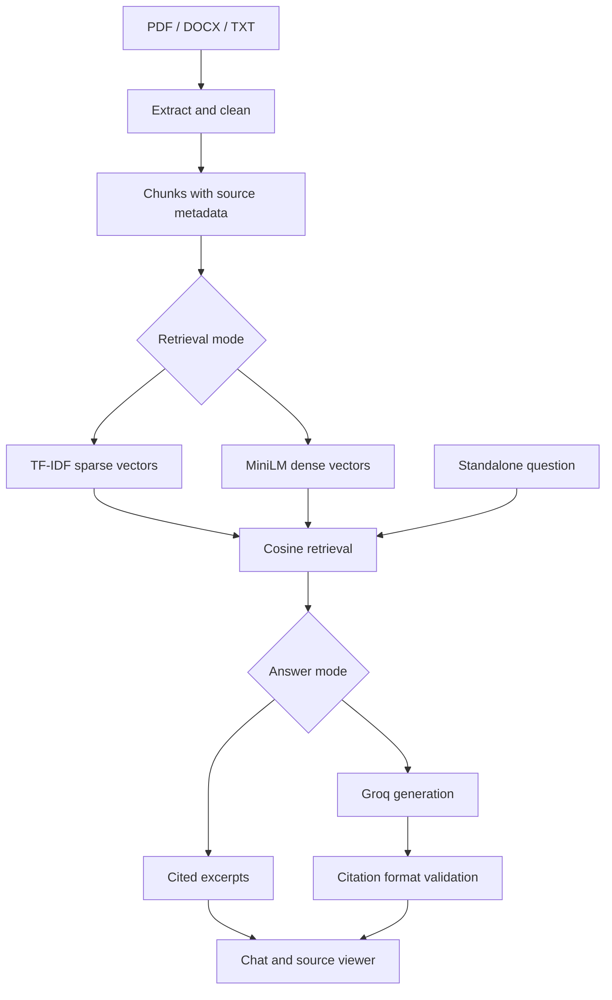

# EvidenceDesk — AI Document Q&A / RAG Knowledge Assistant

A portfolio project for Kavali Harshavardhan. Upload PDF, DOCX or TXT documents, retrieve relevant passages and inspect their source locations. Enable semantic retrieval and optional Groq generation for a full RAG workflow.

**Honest status:** The local lexical/excerpt path is tested. Semantic retrieval and live LLM generation are implemented but require a model download/API access and were not exercised live in the build environment. GitHub location: https://github.com/harshakavali81-collab/document-qa-bot/tree/main/evidencedesk. No public app deployment is included. Fictional sample documents are clearly labeled. No paid service, cloud account or API key is bundled.

## Start in VS Code on Windows

1. Extract this ZIP. Open the `rag-knowledge-assistant` folder in VS Code. For a GitHub checkout, open the `evidencedesk` subfolder.
2. Select **Terminal → New Terminal**. Run:

```powershell
py -3.11 -m venv .venv
.\.venv\Scripts\python.exe -m pip install -r requirements.txt
.\.venv\Scripts\python.exe -m streamlit run app.py
```

Python 3.11 or 3.12 is recommended. If `py -3.11` is unavailable but Python is installed, use `python -m venv .venv`.

3. Open http://localhost:8501. Keep **Use fictional sample documents** checked and click **Build knowledge base**.
4. Ask: **How many annual leave days are available?** The sample answer contains 18 days and a source citation.
5. Expand a source to inspect the evidence. Upload your files and rebuild to replace the index. Ask complete standalone questions: conversational history is displayed, but follow-up question rewriting is not implemented.

macOS/Linux:

```bash
python3 -m venv .venv
.venv/bin/python -m pip install -r requirements.txt
.venv/bin/python -m streamlit run app.py
```

## Three operating modes

| Retrieval | Answering | Requirements | Meaning |
|---|---|---|---|
| Lexical TF-IDF | Exact excerpts | Base dependencies only | Offline retrieval baseline; not generative AI |
| Semantic MiniLM | Exact excerpts | Optional semantic dependencies and initial model download | Dense vector retrieval with citations |
| Either retrieval | Groq LLM | Your key, active model ID, explicit UI consent | Retrieval-augmented answer generation |

TF-IDF is a sparse lexical representation, not a learned semantic embedding. Semantic mode uses normalized sentence embeddings and NumPy exact cosine search. A local JSON/NumPy index is sufficient for this small project; FAISS or a database is a future scaling option. No vector database service is claimed.

### Enable semantic retrieval

```powershell
.\.venv\Scripts\python.exe -m pip install -r requirements-semantic.txt
```

Choose **semantic**, then rebuild. The first build downloads `sentence-transformers/all-MiniLM-L6-v2`; this may take several minutes and requires internet. Default chunks contain 120 whitespace-delimited words with 25-word overlap. They are not token-counted: the model can truncate unusually token-dense text. Test and tune on your real corpus.

### Enable LLM-generated answers

Copy `.env.example` to `.env` in the project root. Fill in your own `GROQ_API_KEY` and `GROQ_MODEL` with an active chat model ID from your Groq console. Restart the app. Enable **Groq AI answers** and the consent checkbox. Your question and retrieved text will be sent to Groq; API usage may incur charges. Key values stay server-side and are not committed.

The generator requests JSON and verifies that cited numbers exist in the retrieved evidence. It rejects malformed citations. This does **not** verify semantic support for every claim; inspect the evidence. Models can still hallucinate or follow malicious document instructions despite the defensive prompt.

## Architecture



PDF citations reference extraction page numbers. DOCX citations reference paragraphs/tables, and TXT citations reference blank-line-separated sections. These are not printed page numbers. DOCX paragraph/table extraction does not preserve interleaved order. PDF table extraction can lose structure. Image-only PDFs require external OCR before upload.

## Persistent index and command line

The web application isolates uploaded content in session memory. It does not write a shared disk index. Use the local CLI for persistence:

```bash
python cli.py index --documents data/sample_documents --output .local_index
python cli.py ask "How much does the Pro plan cost?" --index .local_index
# Optional semantic index:
python cli.py index --backend semantic --output .local_index
```

CLI persistence uses JSON, plus NumPy arrays for semantic vectors; it never loads pickle. Lexical vectors are refitted from stored chunks when reloaded. Semantic vectors are reloaded, while the same encoder is loaded for questions. Reindex the complete folder after changing or deleting a document. Do not share `.local_index`: it contains document text.

## Tests and evaluation

```bash
python -m pip install -r requirements-dev.txt
python -m pytest -q
python -m evaluation.evaluate
```

See `evaluation/results.json` for the actual run, `docs/VALIDATION.md` for scope, and `docs/PROJECT_REPORT.md` for findings and limitations. The authored dataset contains 25 answerable questions and 5 unsupported questions, including difficult related-topic negatives. Retrieval evidence hit rate is not LLM answer accuracy. No LLM correctness, hallucination rate, token cost, or semantic benchmark is claimed.

## Repository contents

- `app.py`: Streamlit upload, chat, settings and evidence viewer.
- `src/core.py`: loaders, cleaning, chunks, lexical/semantic vectors, retrieval and persistence.
- `src/answering.py`: optional Groq generation and citation checks.
- `cli.py`: repeatable local indexing and search.
- `data/sample_documents/`: three fictional, non-sensitive sample documents.
- `evaluation/`: 30 questions, evaluator and measured results.
- `tests/`: loader, retrieval, persistence, citation and UI tests.
- `docs/`: project report, validation, demo/interview guide, GitHub/deployment instructions.
- `Dockerfile`, `.github/workflows/tests.yml`: container and continuous integration configuration.

## Publish and deploy

Follow `docs/GITHUB_AND_DEPLOYMENT.md`. GitHub publication and hosting are separate steps; no hosted app is included. A public demo should use fictional/public documents. Authentication, rate limiting, adversarial testing and provider data-handling review are required before a multi-user production deployment with private documents.

## Technical references

Documentation consulted on 2026-09-30:
- https://docs.streamlit.io/develop/api-reference/widgets/st.file_uploader
- https://docs.streamlit.io/develop/api-reference/app-testing
- https://sbert.net/docs/package_reference/sentence_transformer/model.html
- https://console.groq.com/docs/api-reference
- https://pypdf.readthedocs.io/en/stable/user/extract-text.html

Dependency versions use bounded ranges, not a reproducible lock. A snapshot of this environment's relevant installed versions is in `docs/tested-versions.txt`. The Docker recipe targets Python 3.11; the local validation environment used Python 3.12.

## Full PDF guide

[Read the 12-page workflow and implementation guide](docs/AI_Document_QA_RAG_Full_Project_Guide.pdf).
